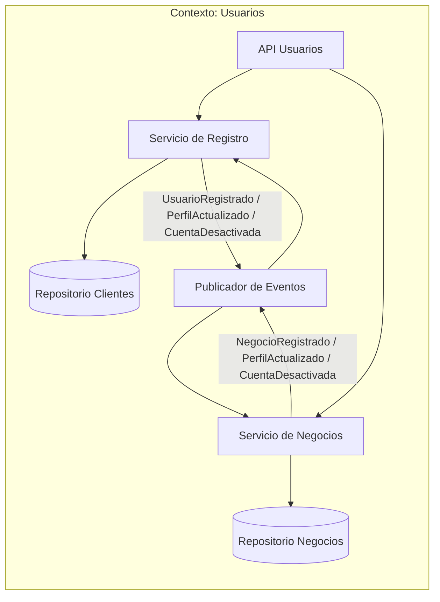
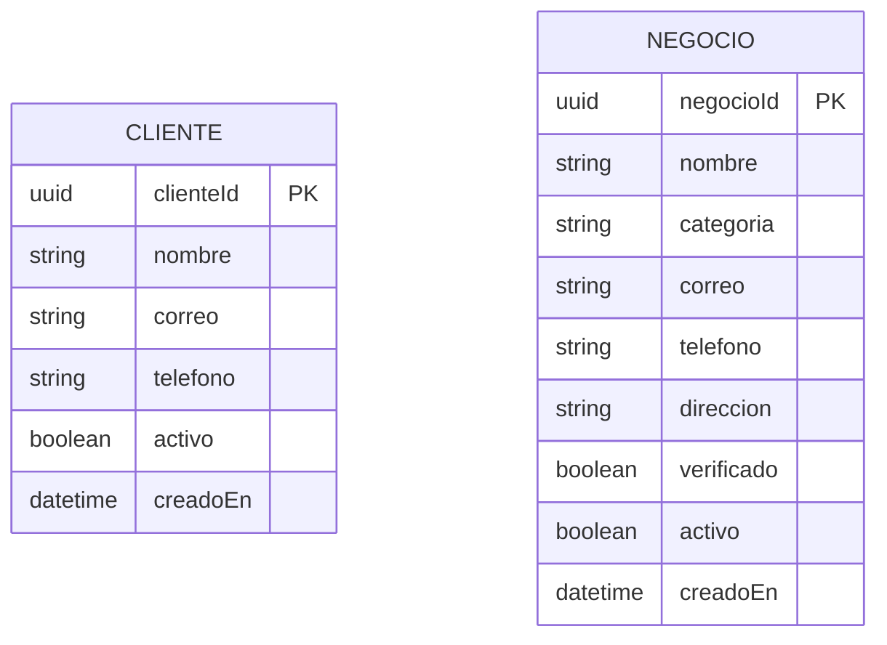
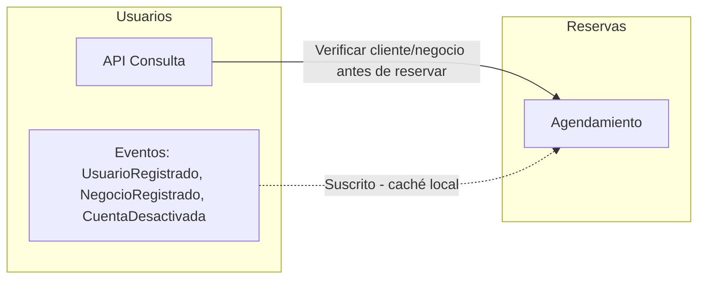
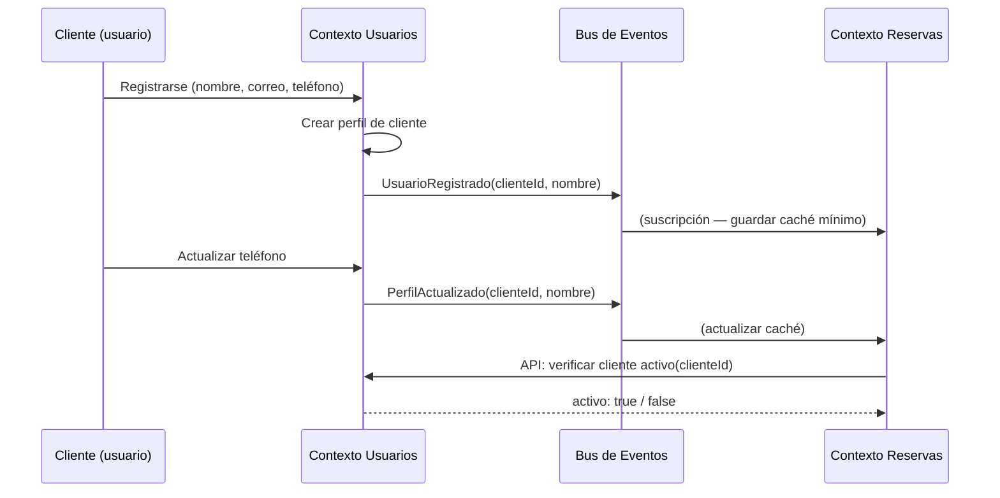

# Contexto delimitado: Usuarios (User Identity)

## Tabla de contenidos

- [Descripción](#descripción)
- [Responsabilidades](#responsabilidades)
- [Lenguaje ubicuo](#lenguaje-ubicuo)
- [Modelo del dominio](#modelo-del-dominio)
  - [Entidades principales](#entidades-principales)
  - [Lo que este contexto NO sabe](#lo-que-este-contexto-no-sabe)
- [Eventos](#eventos)
  - [Eventos emitidos](#eventos-emitidos-publicados-por-este-contexto)
  - [Eventos consumidos](#eventos-consumidos)
- [Diagramas](#diagramas)
  - [Comunicación interna](#comunicación-interna-del-contexto)
  - [Agregados y entidades internas](#agregados-y-entidades-internas)
  - [Comunicación con otros contextos](#comunicación-con-otros-contextos-delimitados)
- [Resumen](#resumen)

---

## Descripción

El contexto de **Usuarios** es la fuente de verdad de la identidad dentro de CitaYa. Gestiona dos tipos de actores: los **clientes** que reservan turnos y los **negocios** que ofrecen servicios. Los demás contextos no almacenan datos de identidad — solo guardan una referencia mínima (`usuarioId` o `negocioId`) y la consultan cuando la necesitan.

## Responsabilidades

- Registrar y autenticar **clientes** en la plataforma.
- Registrar y verificar **negocios** (barberías, talleres, consultorios, etc.).
- Mantener **perfiles** con datos de contacto actualizados.
- Gestionar la **activación y desactivación** de cuentas.
- Exponer una API de consulta para que otros contextos verifiquen si un usuario o negocio existe y está activo.

## Lenguaje ubicuo

| Término | Significado en este contexto |
|---|---|
| **Cliente** | Persona registrada que puede hacer reservas en CitaYa |
| **Negocio** | Proveedor de servicios registrado (barbería, mecánico, etc.) |
| **Perfil** | Conjunto de datos de identidad y contacto de un usuario o negocio |
| **Verificación** | Proceso de confirmar que un negocio es legítimo antes de publicar sus servicios |
| **Desactivación** | Suspensión temporal o permanente de una cuenta |

## Modelo del dominio

### Entidades principales

```
Cliente {
  clienteId   : UUID
  nombre      : String
  correo      : String
  telefono    : String
  activo      : Boolean
  creadoEn    : DateTime
}

Negocio {
  negocioId   : UUID
  nombre      : String
  categoria   : String     -- "Barbería", "Taller Mecánico", "Consultorio", etc.
  correo      : String
  telefono    : String
  direccion   : String
  verificado  : Boolean
  activo      : Boolean
  creadoEn    : DateTime
}
```

### Lo que este contexto NO sabe

- Nada sobre reservas, horarios ni disponibilidad.
- Nada sobre servicios ofrecidos ni precios.
- Nada sobre pagos, ingresos ni transacciones.

---

## Eventos

### Eventos emitidos (publicados por este contexto)

| Evento | Descripción | Consumidores típicos |
|---|---|---|
| `UsuarioRegistrado` | Un nuevo cliente se registró exitosamente | Reservas (caché local de nombre) |
| `NegocioRegistrado` | Un nuevo negocio fue verificado y activado | Reservas (habilitar para publicar disponibilidad) |
| `PerfilActualizado` | Se modificaron datos del perfil | Reservas (actualizar caché) |
| `CuentaDesactivada` | Una cuenta fue suspendida | Reservas (cancelar reservas pendientes) |

### Eventos consumidos

Ninguno. Este contexto es el **origen de la identidad** — no depende de otros contextos para mantener su modelo.

---

## Diagramas

### Comunicación interna del contexto



### Agregados y entidades internas



### Comunicación con otros contextos delimitados

Usuarios actúa como **proveedor de identidad**: otros contextos lo consultan vía API o reaccionan a sus eventos para mantener cachés locales mínimos.





---

## Resumen

| Aspecto | Detalle |
|---|---|
| **Responsabilidad** | Gestionar la identidad de clientes y negocios: registro, perfil, activación |
| **Cliente** | Persona con identidad verificada (`clienteId`, nombre, correo, teléfono) |
| **Negocio** | Proveedor de servicios verificado (`negocioId`, nombre, categoría, dirección) |
| **Comunicación** | Emite eventos de ciclo de vida; expone API de consulta para Reservas |
| **Independencia** | No depende de ningún otro contexto para mantener su modelo |
