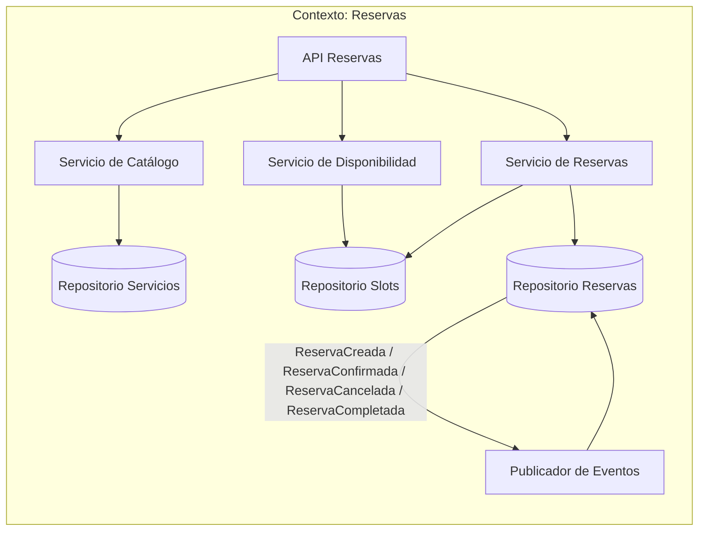
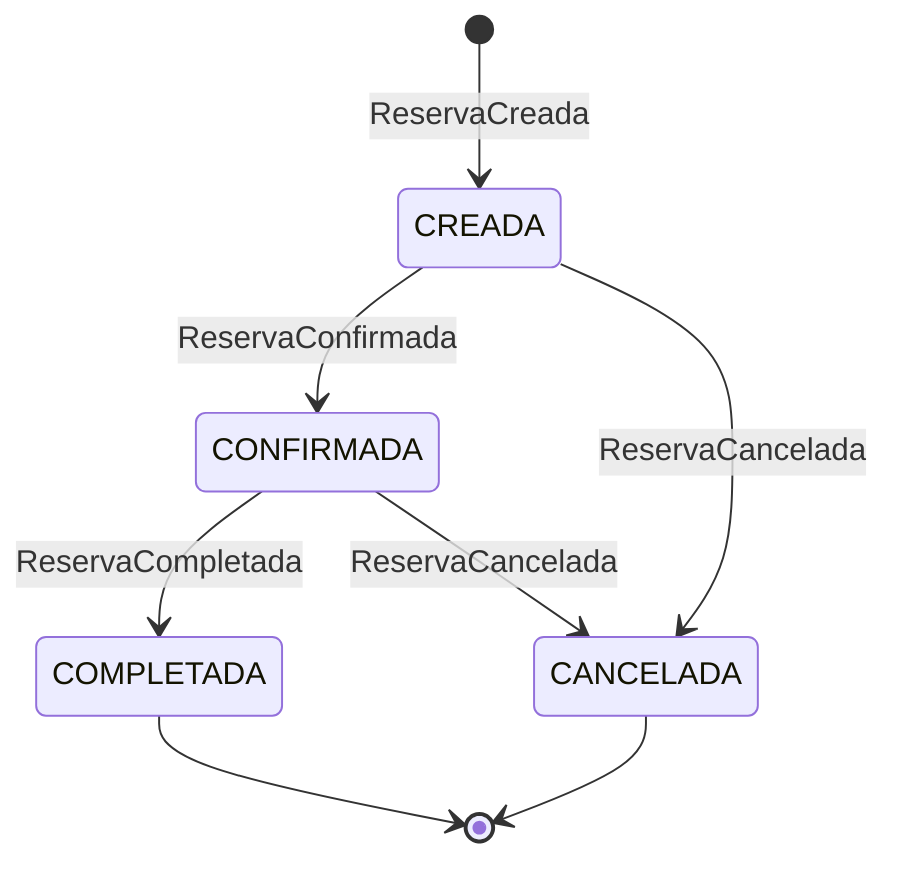
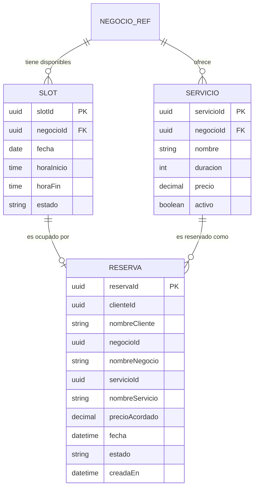
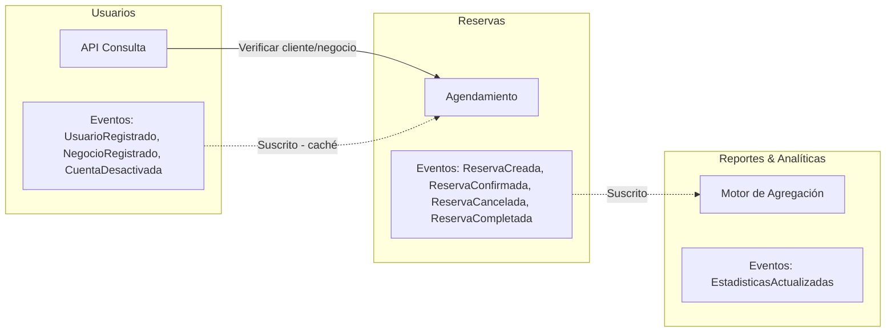
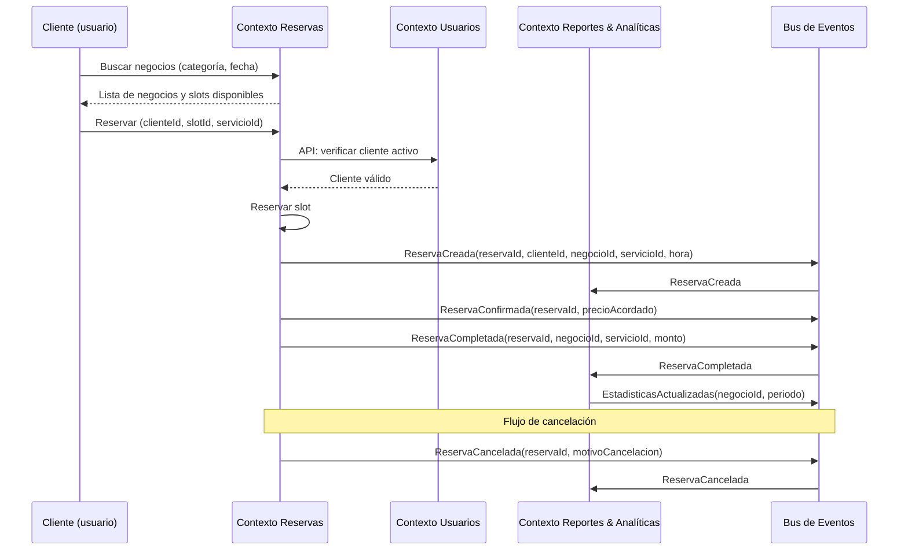

# Contexto delimitado: Reservas (Booking)

## Tabla de contenidos

- [Descripción](#descripción)
- [Responsabilidades](#responsabilidades)
- [Lenguaje ubicuo](#lenguaje-ubicuo)
- [Modelo del dominio](#modelo-del-dominio)
  - [Entidades principales](#entidades-principales)
  - [Estados típicos de una reserva](#estados-típicos-de-una-reserva)
  - [Lo que este contexto NO sabe](#lo-que-este-contexto-no-sabe)
- [Eventos](#eventos)
  - [Eventos emitidos](#eventos-emitidos-publicados-por-este-contexto)
  - [Eventos consumidos](#eventos-consumidos-de-otros-contextos)
- [Diagramas](#diagramas)
  - [Comunicación interna](#comunicación-interna-del-contexto)
  - [Ciclo de vida de una reserva](#ciclo-de-vida-de-una-reserva-estados)
  - [Modelo de datos interno](#modelo-de-datos-interno)
  - [Comunicación con otros contextos](#comunicación-con-otros-contextos-delimitados)
  - [Secuencia: de búsqueda a reserva completada](#secuencia-de-búsqueda-a-reserva-completada)
- [Resumen](#resumen)

---

## Descripción

El contexto de **Reservas** es el núcleo operativo de CitaYa. Gestiona el catálogo de servicios que cada negocio ofrece, su disponibilidad horaria y el ciclo de vida completo de cada reserva — desde que el cliente busca un horario hasta que el servicio es completado o cancelado. No maneja dinero ni datos de identidad completos.

## Responsabilidades

- Publicar y gestionar el **catálogo de servicios** de cada negocio (nombre, duración, precio de referencia).
- Gestionar la **disponibilidad** de cada negocio por día y hora.
- Permitir a los clientes **buscar negocios** por categoría y **reservar** un slot.
- Gestionar el **ciclo de vida** de la reserva: CREADA → CONFIRMADA → COMPLETADA o CANCELADA.
- Emitir notificaciones de confirmación, recordatorios y cancelaciones.

## Lenguaje ubicuo

| Término | Significado en este contexto |
|---|---|
| **Reserva** | Compromiso de un cliente con un negocio para recibir un servicio en un horario específico |
| **Servicio** | Actividad ofrecida por un negocio con nombre, duración y precio de referencia |
| **Slot** | Franja horaria disponible en la agenda de un negocio |
| **Disponibilidad** | Conjunto de slots libres de un negocio en un período |
| **Confirmación** | Validación de la reserva por parte del negocio |

## Modelo del dominio

### Entidades principales

Un **cliente** o **negocio** en este contexto es solo una referencia mínima — no se almacenan perfiles completos:

```
Servicio {
  servicioId  : UUID
  negocioId   : UUID
  nombre      : String    -- "Corte de cabello", "Cambio de aceite", etc.
  duracion    : Int       -- minutos
  precio      : Decimal   -- precio de referencia
  activo      : Boolean
}

Slot {
  slotId      : UUID
  negocioId   : UUID
  fecha       : Date
  horaInicio  : Time
  horaFin     : Time
  estado      : DISPONIBLE | RESERVADO | BLOQUEADO
}

Reserva {
  reservaId       : UUID
  clienteId       : UUID
  nombreCliente   : String    -- snapshot mínimo del caché
  negocioId       : UUID
  nombreNegocio   : String    -- snapshot mínimo
  servicioId      : UUID
  nombreServicio  : String    -- snapshot al momento de reservar
  precioAcordado  : Decimal   -- precio al momento de reservar
  fecha           : DateTime
  estado          : ReservaEstado
  motivoCancelacion: String?
  creadaEn        : DateTime
}
```

### Estados típicos de una reserva

| Estado | Descripción |
|---|---|
| **CREADA** | El cliente solicitó el slot, pendiente de confirmación del negocio |
| **CONFIRMADA** | El negocio confirmó la reserva |
| **COMPLETADA** | El servicio fue prestado exitosamente |
| **CANCELADA** | El cliente o el negocio canceló la reserva |

### Lo que este contexto NO sabe

- Nada sobre pagos, transacciones ni reportes financieros.
- El "cliente" aquí es solo `{ clienteId, nombreCliente }` — sin datos de contacto completos.
- Nada sobre la verificación legal o fiscal de los negocios.

---

## Eventos

### Eventos emitidos (publicados por este contexto)

| Evento | Descripción | Consumidores típicos |
|---|---|---|
| `ReservaCreada` | Un cliente solicitó una reserva | Notificaciones |
| `ReservaConfirmada` | El negocio confirmó la reserva | Notificaciones, Ingresos (anticipar transacción) |
| `ReservaCancelada` | La reserva fue cancelada | Notificaciones |
| `ReservaCompletada` | El servicio fue prestado y la reserva cerrada | Reportes & Analíticas (registrar ingreso y actualizar métricas) |

### Eventos consumidos (de otros contextos)

| Evento | Origen | Uso en Reservas |
|---|---|---|
| `UsuarioRegistrado` | Usuarios | Guardar caché local `{ clienteId, nombre }` |
| `NegocioRegistrado` | Usuarios | Guardar caché local `{ negocioId, nombre, categoría }` |
| `PerfilActualizado` | Usuarios | Actualizar nombre en caché si cambió |
| `CuentaDesactivada` | Usuarios | Cancelar reservas pendientes de esa cuenta |
| `EstadisticasActualizadas` | Reportes & Analíticas | Confirmación de que las métricas fueron actualizadas (opcional) |

---

## Diagramas

### Comunicación interna del contexto



### Ciclo de vida de una reserva (estados)



### Modelo de datos interno



### Comunicación con otros contextos delimitados



### Secuencia: de búsqueda a reserva completada



---

## Resumen

| Aspecto | Detalle |
|---|---|
| **Responsabilidad** | Catálogo de servicios, disponibilidad horaria y ciclo de vida de reservas |
| **Cliente/Negocio** | Referencias mínimas `{ id, nombre }` — sin datos de contacto ni financieros |
| **Estados** | CREADA → CONFIRMADA → COMPLETADA, o CANCELADA |
| **Comunicación** | Consulta Usuarios; emite ReservaCompletada y ReservaCancelada para Ingresos |
| **Independencia** | No maneja dinero; puede integrarse con calendarios externos sin afectar otros contextos |
