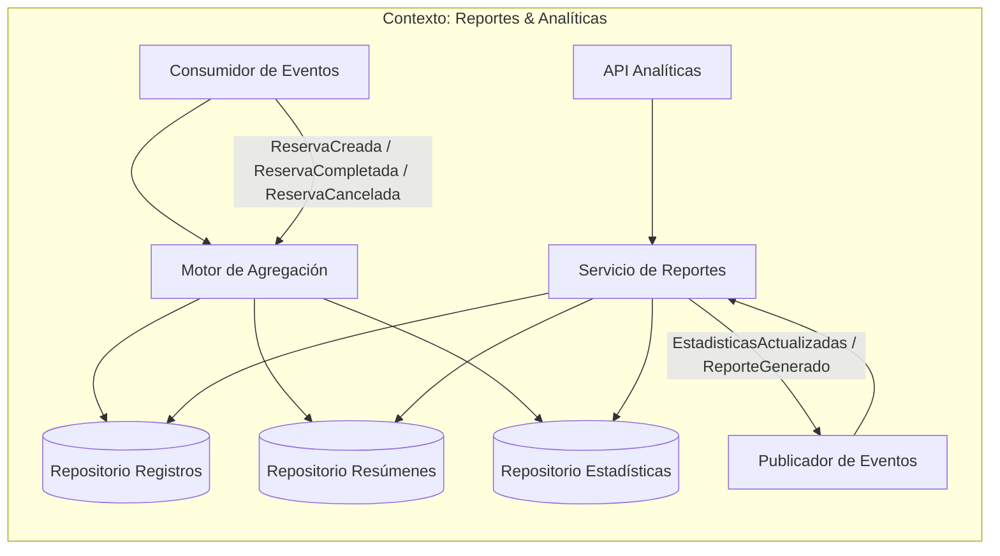
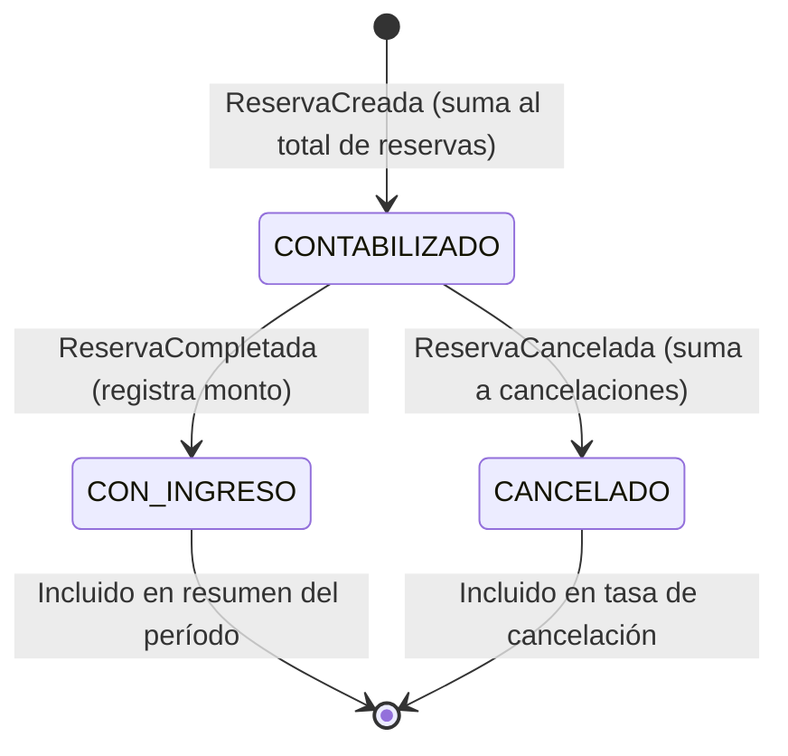
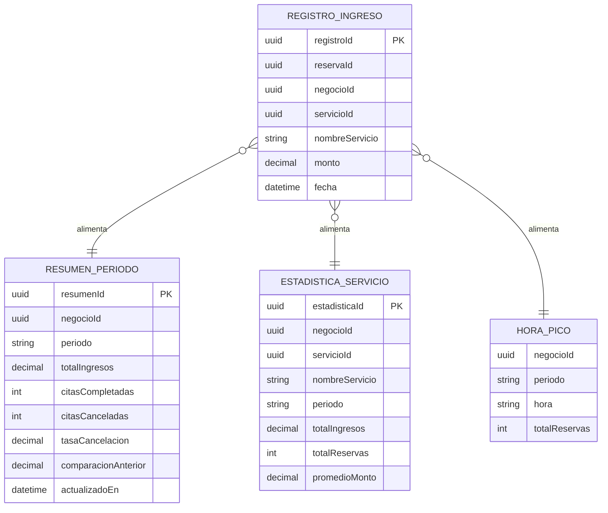
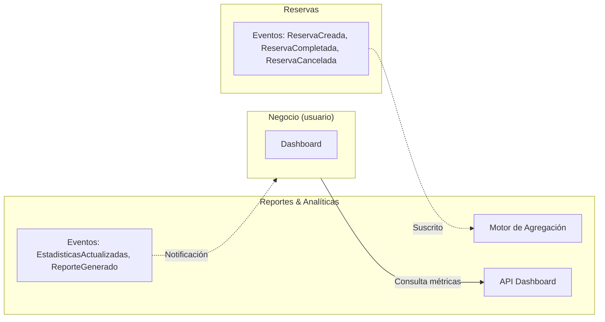
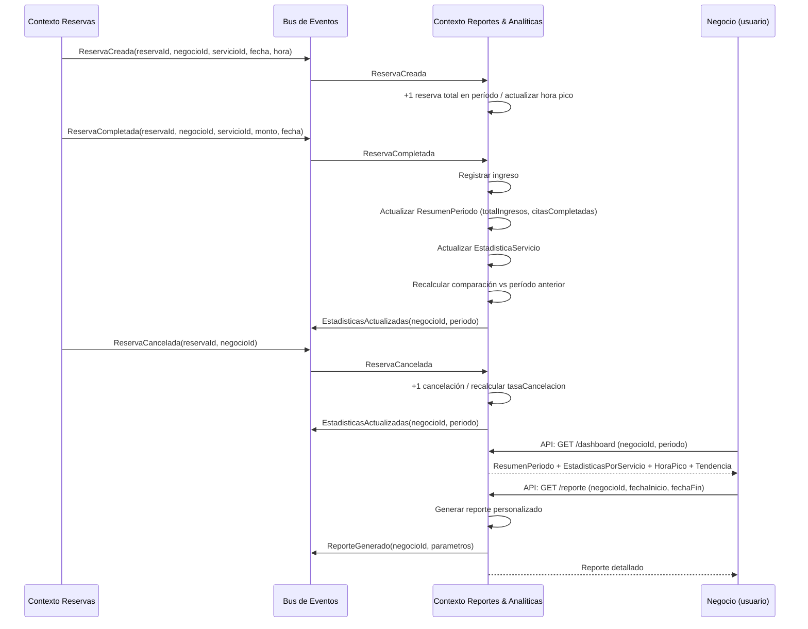

# Contexto delimitado: Reportes & Analíticas (Analytics)

## Tabla de contenidos

- [Descripción](#descripción)
- [Responsabilidades](#responsabilidades)
- [Lenguaje ubicuo](#lenguaje-ubicuo)
- [Modelo del dominio](#modelo-del-dominio)
  - [Entidades principales](#entidades-principales)
  - [Lo que este contexto NO sabe](#lo-que-este-contexto-no-sabe)
- [Eventos](#eventos)
  - [Eventos emitidos](#eventos-emitidos-publicados-por-este-contexto)
  - [Eventos consumidos](#eventos-consumidos-de-otros-contextos)
- [Diagramas](#diagramas)
  - [Comunicación interna](#comunicación-interna-del-contexto)
  - [Ciclo de vida de un registro analítico](#ciclo-de-vida-de-un-registro-analítico)
  - [Modelo de datos interno](#modelo-de-datos-interno)
  - [Comunicación con otros contextos](#comunicación-con-otros-contextos-delimitados)
  - [Secuencia: de ReservaCompletada a dashboard actualizado](#secuencia-de-reservacompletada-a-dashboard-actualizado)
- [Resumen](#resumen)

---

## Descripción

El contexto de **Reportes & Analíticas** transforma los eventos del sistema en información útil para que los negocios tomen decisiones. No procesa cobros ni gestiona reservas — escucha lo que ocurre en el sistema y construye agregaciones, métricas y reportes que se presentan en el dashboard del negocio. La diferencia entre este contexto y simplemente "leer un dato" es que aquí vive toda la lógica de qué significa ese dato: comparar períodos, detectar tendencias, identificar servicios populares y horas pico.

## Responsabilidades

- Registrar el **ingreso generado** por cada cita completada.
- Calcular **totales por período** (diario, semanal, mensual).
- Generar **estadísticas por servicio** (cuánto genera cada servicio, cuántas veces se reserva).
- Identificar **servicios más solicitados** y **horas pico** de reservas.
- Calcular **tasa de cancelación** por negocio y período.
- Permitir **comparar períodos** (este mes vs el anterior).
- Exponer datos listos para consumir desde un **dashboard**.

## Lenguaje ubicuo

| Término | Significado en este contexto |
|---|---|
| **Métrica** | Valor calculado a partir de eventos del sistema (ingresos, citas, cancelaciones) |
| **Período** | Rango de tiempo sobre el que se agrupan métricas (día, semana, mes) |
| **Resumen** | Agregación de métricas de un negocio en un período específico |
| **Tendencia** | Comparación de una métrica entre dos períodos consecutivos |
| **Hora pico** | Franja horaria con mayor concentración de reservas |
| **Tasa de cancelación** | Porcentaje de reservas canceladas sobre el total creadas |

## Modelo del dominio

### Entidades principales

Una **reserva** en este contexto no es un horario — es un **evento que alimenta métricas**:

```
RegistroIngreso {
  registroId   : UUID
  reservaId    : UUID
  negocioId    : UUID
  servicioId   : UUID
  nombreServicio: String
  monto        : Decimal
  fecha        : DateTime
}

ResumenPeriodo {
  resumenId       : UUID
  negocioId       : UUID
  periodo         : String      -- "2026-03", "2026-W13", "2026-03-27"
  totalIngresos   : Decimal
  citasCompletadas: Int
  citasCanceladas : Int
  tasaCancelacion : Decimal     -- porcentaje calculado
  comparacionAnterior: Decimal  -- % de variación vs período previo
  actualizadoEn   : DateTime
}

EstadisticaServicio {
  estadisticaId   : UUID
  negocioId       : UUID
  servicioId      : UUID
  nombreServicio  : String
  periodo         : String
  totalIngresos   : Decimal
  totalReservas   : Int
  promedioMonto   : Decimal
}

HoraPico {
  negocioId    : UUID
  periodo      : String
  hora         : String         -- "09:00", "10:00", etc.
  totalReservas: Int
}
```

### Lo que este contexto NO sabe

- Nada sobre disponibilidad horaria ni cómo se gestiona una reserva.
- Nada sobre datos personales de clientes o negocios.
- No procesa cobros reales — el monto viene del precio definido en la reserva.
- No toma decisiones de negocio — solo presenta la información para que el dueño las tome.

---

## Eventos

### Eventos emitidos (publicados por este contexto)

| Evento | Descripción | Consumidores típicos |
|---|---|---|
| `EstadisticasActualizadas` | Se recalcularon las métricas de un negocio | Dashboard (actualizar vista en tiempo real) |
| `ReporteGenerado` | Un negocio solicitó y recibió un reporte personalizado | Notificaciones (enviar reporte por correo) |

### Eventos consumidos (de otros contextos)

| Evento | Origen | Uso en Reportes & Analíticas |
|---|---|---|
| `ReservaCreada` | Reservas | Incrementar contador de reservas totales del período |
| `ReservaCompletada` | Reservas | Registrar ingreso, actualizar métricas de servicio y hora |
| `ReservaCancelada` | Reservas | Incrementar contador de cancelaciones, recalcular tasa |

---

## Diagramas

### Comunicación interna del contexto



### Ciclo de vida de un registro analítico



### Modelo de datos interno



### Comunicación con otros contextos delimitados

Reportes & Analíticas **solo escucha** — no inicia comunicación con otros contextos ni consulta APIs externas. Toda su información viene de eventos.



### Secuencia: de ReservaCompletada a dashboard actualizado



---

## Resumen

| Aspecto | Detalle |
|---|---|
| **Responsabilidad** | Transformar eventos del sistema en métricas, tendencias y reportes para el dashboard del negocio |
| **Reserva** | Evento que alimenta métricas `{ reservaId, negocioId, servicioId, monto, fecha }` |
| **Métricas clave** | Ingresos por período, tasa de cancelación, servicios más solicitados, horas pico, comparación de períodos |
| **Comunicación** | Solo consume eventos de Reservas; expone API de consulta para dashboards |
| **Independencia** | No gestiona reservas ni perfiles; puede evolucionar con nuevas métricas sin afectar otros contextos |
