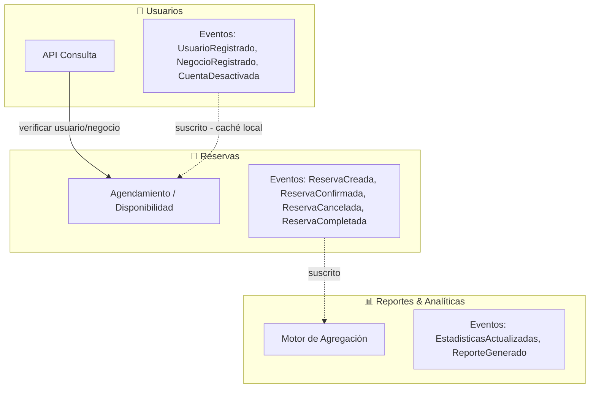
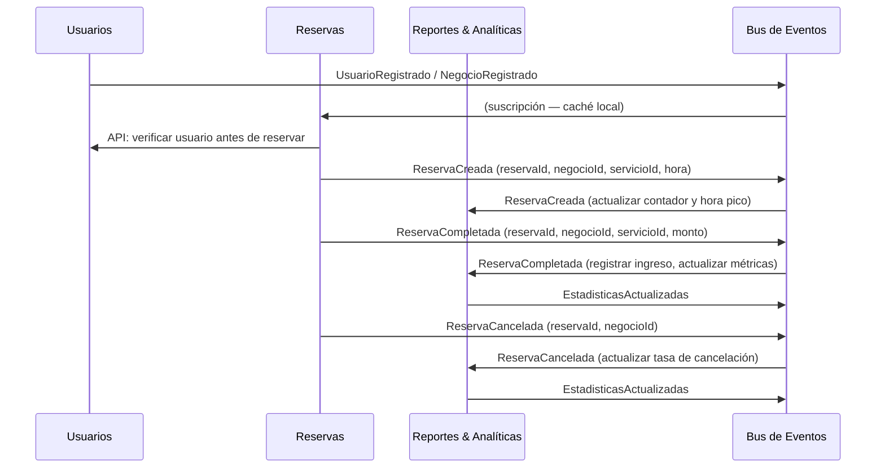

# CitaYa: Plataforma de Reservas para Negocios de Servicios
## Tarea #1: Identificación de Contextos Delimitados (Bounded Contexts)

Sistema ficticio que permite a cualquier negocio de servicios (barberías, talleres mecánicos, consultorios, tutores, etc.) publicar su disponibilidad y a los clientes reservar turnos en línea de forma sencilla.

---

## Tabla de contenidos

- [Descripción del sistema](#descripción-del-sistema)
- [Contextos y documentación](#contextos-y-documentación)
- [Diagrama: interacción entre contextos](#diagrama-interacción-entre-contextos)
- [Flujo de eventos (secuencia)](#flujo-de-eventos-secuencia)
- [Eventos por contexto](#eventos-por-contexto)
- [Resumen de cada contexto](#resumen-de-cada-contexto)
- [Justificación de la división](#justificación-de-la-división)

---

## Descripción del sistema

**CitaYa** es una plataforma digital que conecta negocios de servicios con sus clientes. Desde la perspectiva del usuario:

- **Cliente**: Se registra en la plataforma, busca negocios por categoría (barbería, mecánico, dentista, etc.) y reserva un turno en el horario que le convenga. Recibe confirmaciones y recordatorios. Al completar la cita, puede ver su historial de reservas.

- **Negocio**: Se registra como proveedor de servicios, define los servicios que ofrece (nombre, duración, precio) y configura su disponibilidad semanal. Cuando un cliente hace una reserva, recibe una notificación. Al final del día puede consultar sus ingresos del período.

- **Administrador de CitaYa**: Supervisa los negocios registrados, gestiona usuarios y tiene acceso a reportes de actividad e ingresos de la plataforma.

---

## Contextos y documentación

| Contexto | Responsabilidad | Documentación |
|---|---|---|
| **Usuarios** | Gestionar la identidad de clientes y negocios registrados en la plataforma | [01-contexto-usuarios.md](01-contexto-usuarios.md) |
| **Reservas** | Gestionar el catálogo de servicios, la disponibilidad y el ciclo de vida de las reservas | [02-contexto-reservas.md](02-contexto-reservas.md) |
| **Reportes & Analíticas** | Transformar eventos del sistema en métricas, tendencias y reportes para el dashboard del negocio | [03-contexto-reportes-analiticas.md](03-contexto-reportes-analiticas.md) |

---

## Diagrama: interacción entre contextos

Líneas sólidas: API síncrona (Reservas verifica que el usuario exista antes de confirmar una reserva).
Líneas punteadas: eventos asincrónicos publicados/consumidos a través del bus de eventos.

---

## Flujo de eventos (secuencia)

---

## Eventos por contexto

| Contexto | Emite | Consume |
|---|---|---|
| **Usuarios** | `UsuarioRegistrado`, `NegocioRegistrado`, `PerfilActualizado`, `CuentaDesactivada` | — |
| **Reservas** | `ReservaCreada`, `ReservaConfirmada`, `ReservaCancelada`, `ReservaCompletada` | `UsuarioRegistrado`, `NegocioRegistrado`, `CuentaDesactivada` |
| **Reportes & Analíticas** | `EstadisticasActualizadas`, `ReporteGenerado` | `ReservaCreada`, `ReservaCompletada`, `ReservaCancelada` |

---

## Resumen de cada contexto

**Usuarios**: `Usuario = persona o negocio con identidad verificada (id, nombre, correo, tipo, activo)`. No sabe de reservas ni analíticas.

**Reservas**: `Usuario = referencia mínima { usuarioId, nombre }`. Estado de reserva: `CREADA → CONFIRMADA → COMPLETADA` o `CANCELADA`. No genera reportes.

**Reportes & Analíticas**: `Reserva = evento que alimenta métricas { reservaId, negocioId, servicioId, monto, fecha, hora }`. No gestiona disponibilidad ni identidad.

El mismo concepto cambia de significado por contexto:

| Concepto | Usuarios | Reservas | Reportes & Analíticas |
|---|---|---|---|
| **Usuario** | Persona o negocio registrado | Quien ocupa un slot horario | Fuente de datos de comportamiento |
| **Negocio** | Proveedor con perfil verificado | Recurso con disponibilidad | Sujeto de métricas e ingresos |
| **Servicio** | No existe | Item reservable con duración y precio | Dimensión de análisis |

Un contexto delimitado protege el significado de su modelo dentro de sus propias fronteras.

---

## Justificación de la división

La separación en tres contextos refleja tres dominios de negocio con responsabilidades, ciclos de cambio y equipos distintos:

1. **Usuarios** es la fuente de verdad de la identidad en la plataforma. Tanto clientes como negocios se registran aquí. Su información cambia por razones administrativas (actualización de perfil, políticas de privacidad). Los demás contextos solo necesitan una referencia mínima (`usuarioId`), no el perfil completo. Separarlo evita que un cambio en el modelo de identidad afecte la lógica de agendamiento o los registros financieros.

2. **Reservas** concentra toda la complejidad operativa: catálogo de servicios, gestión de slots horarios, conflictos de disponibilidad, confirmaciones y cancelaciones. Separarlo permite escalar este servicio de forma independiente — es el más consultado en tiempo real — y eventualmente integrarlo con calendarios externos (Google Calendar, Outlook) sin tocar la parte financiera.

3. **Reportes & Analíticas** transforma los eventos del sistema en información accionable para el negocio: cuánto ganó esta semana, qué servicio genera más ingresos, a qué hora llegan más clientes, cómo está el mes comparado con el anterior. Esta lógica de agregación y cálculo es distinta de la lógica de agendar una cita — tiene su propio modelo, sus propias reglas de cálculo y su propio ritmo de cambio. Separarlo permite agregar nuevas métricas o vistas de dashboard sin afectar la disponibilidad ni los perfiles de usuario.

**Principio guía**: cada contexto tiene su propio modelo del mismo concepto, sus propias reglas de negocio y puede desplegarse, escalarse y mantenerse de forma independiente. Convertirlos en microservicios — `User Service`, `Booking Service`, `Revenue Service` — cada uno con su propia base de datos, evita el acoplamiento y permite que equipos distintos trabajen en paralelo sin interferirse.
